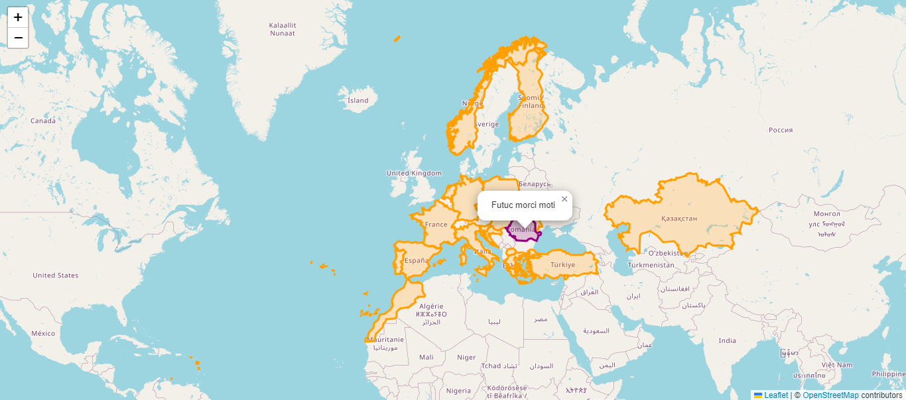

# Swearing Map

Welcome to the Swearing Map, an interactive map component built with React and Leaflet. This map component is designed to display swear words from countries and additional information based on user interaction.

## Features

- Interactive Map: Utilizes the Leaflet library to create an interactive and dynamic map.
- Country Borders: Displays country borders using GeoJSON data.
- Popup Information: Provides popup information about a selected country, including words associated with the country.

## Usage

To integrate the Swearing Map into your project, follow these steps:

1. Install Dependencies:
```npm install leaflet react-leaflet recoil uuid```

2. Map Component Integration:
Import the Map component into your project, as shown in the example below:
```
import Map from "./components/Map";

const App = () => {
  return (
    <div className="App">
      {/* Other components */}
      <Map />
    </div>
  );
};

export default App;
```

3. Customization:
Customize the map styles, center, zoom level, and other properties based on your project requirements.
```
const mapCenter = [49.308877665000068, 20.135855754000119];
// ...

<MapContainer center={mapCenter} zoom={4} scrollWheelZoom={true}>
  {/* ... */}
</MapContainer>
```

4. Additional State Management:
The map utilizes Recoil for state management. Adjust the countryAtom and related state management based on your application's needs.

## Data Source
The map utilizes GeoJSON data for country borders. The GeoJSON data is loaded from the Borders file located in the data directory.

## Screenshots



## License
This project is licensed under the MIT License - see the [LICENSE](LICENSE) file for details.

## TODO

-   no wrapping map (only one instance of tiles)
-   clicking one more time on the same country
-   submitting new words
-   sidebar
    -   filter
    -   all words
-   statistics of countries
