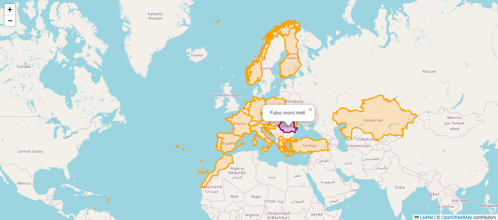

# Swearing Map

Welcome to the Swearing Map, an interactive map component built with React and Leaflet. This map component is designed to display swear words from countries and additional information based on user interaction.

## Features

- Interactive Map: Utilizes the Leaflet library to create an interactive and dynamic map.
- Country Borders: Displays country borders using GeoJSON data.
- Popup Information: Provides popup information about a selected country, including words associated with the country.

## Project status

The current application is a proof of concept. It is being evolved through reviewed tickets and
architecture decisions toward a production product. See the accepted decisions in
[`docs/adr`](docs/adr) and the current foundation epic in
[`docs/tickets/EPIC-00-engineering-foundation.md`](docs/tickets/EPIC-00-engineering-foundation.md).

## Workspace

The repository is an Nx-managed pnpm workspace. The product shell lives in the Next.js App Router
project at `apps/web`; the existing proof-of-concept map remains isolated in `apps/map` and is
assembled under the `/map/` route. Upcoming NestJS and shared-library projects can be added beside
them without coupling their build and test lifecycles.

Useful workspace commands:

```sh
pnpm nx show project map
pnpm nx show project web
pnpm nx graph
pnpm nx affected -t lint typecheck test build --base origin/main --head HEAD --parallel=2
```

Nx caches deterministic task outputs in `.nx/cache`. No global Nx installation is required.

`pnpm dev` starts the Next.js product shell. Use `pnpm dev:map` when working on the isolated map.
`pnpm build` builds both projects and assembles the exact static artifact served by `pnpm preview`
and the production container.

## Development

Prerequisites are Node.js from `.nvmrc` and Corepack.

```sh
corepack enable
pnpm install --frozen-lockfile
pnpm dev
```

Run all local quality gates before opening a pull request:

```sh
pnpm check
```

Individual commands include `pnpm format:check`, `pnpm lint`, `pnpm typecheck`, `pnpm test`,
`pnpm test:coverage`, `pnpm audit`, and `pnpm build`.

The ticket, branch, commit, review, and Definition of Done workflow is documented in
[`CONTRIBUTING.md`](CONTRIBUTING.md).

## Data Source

The map utilizes GeoJSON data for country borders. The GeoJSON data is loaded from the Borders file located in the data directory.

## Screenshots



## License

This project is licensed under the MIT License - see the [LICENSE](LICENSE) file for details.

## TODO

- no wrapping map (only one instance of tiles)
- clicking one more time on the same country
- submitting new words
- sidebar
  - filter
  - all words
- statistics of countries
