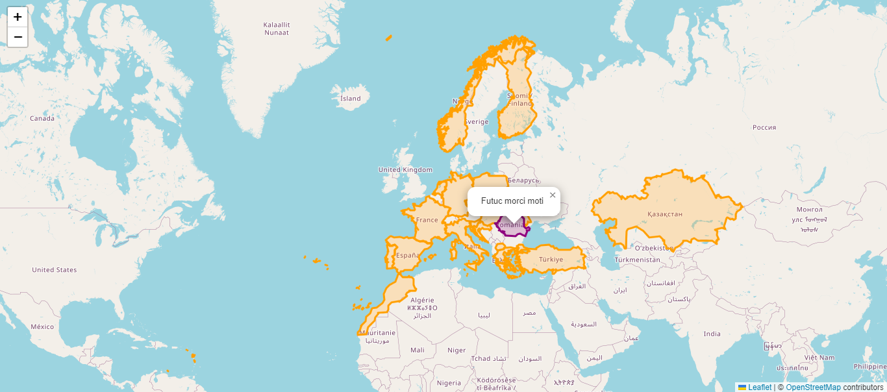

# Swearing Map

Welcome to the Swearing Map, an interactive map component built with React and Leaflet. This map component is designed to display swear words from countries and additional information based on user interaction.

## Features

- Interactive Map: Utilizes the Leaflet library to create an interactive and dynamic map.
- Country Borders: Displays country borders using GeoJSON data.
- Popup Information: Provides popup information about a selected country, including words associated with the country.

## Project status

The current application is a proof of concept. It is being evolved through reviewed tickets and
architecture decisions toward a production product. See the accepted decisions in
[`docs/adr`](docs/adr) and the current foundation epic in
[`docs/tickets/EPIC-00-engineering-foundation.md`](docs/tickets/EPIC-00-engineering-foundation.md).

## Workspace

The repository is an Nx-managed pnpm workspace. The product shell lives in the Next.js App Router
project at `apps/web`; the existing proof-of-concept map remains isolated in `apps/map` and is
assembled under the `/map/` route. The versioned NestJS modular-monolith API lives in `apps/api`,
and its reproducible OpenAPI contract and typed Fetch client live in `libs/api-client`.
PostgreSQL 17 with PostGIS 3.5 is the primary persistence layer. Prisma ORM 7 owns the relational
schema, migrations, deterministic seed data, and generated type-safe client.

Useful workspace commands:

```sh
pnpm nx show project map
pnpm nx show project web
pnpm nx show project api
pnpm nx show project api-client
pnpm nx graph
pnpm nx affected -t lint typecheck test build --base origin/main --head HEAD --parallel=2
```

Nx caches deterministic task outputs in `.nx/cache`. No global Nx installation is required.

`pnpm dev` starts the Next.js product shell. Use `pnpm dev:map` when working on the isolated map,
or `pnpm dev:api` for the API. The API health endpoint is `/api/v1/health`, Swagger UI is available
at `/api/docs`, and the machine-readable contract is `/api/openapi.json`. `pnpm build` builds all
applications and assembles the exact static artifact served by `pnpm preview` and the web
production container.

Run `pnpm generate` after cloning or changing Prisma schemas, controllers, DTOs, or code-generator
configuration. Nx restores unchanged outputs from `.nx/cache` and otherwise generates the Prisma
Client, OpenAPI document, and typed Fetch client in dependency order. `pnpm api:openapi` and
`pnpm api:client:generate` run the corresponding narrower cacheable targets.

Generated source artifacts are intentionally ignored and must never be committed. Their reviewed
sources of truth are the Prisma schemas and migrations, NestJS controllers and DTOs, generator
configuration and scripts, package manifest, and lockfile. The Prisma schema is split by domain
under `apps/api/prisma/models`; `schema.prisma` contains only the generator and datasource. Builds,
tests, Fallow, local API startup, and CI request the generation targets before consuming their
outputs. See the database runbook linked below for the complete workflow.

## Development

Prerequisites are Node.js from `.nvmrc` and Corepack.

```sh
corepack enable
pnpm install --frozen-lockfile
pnpm db:up
pnpm db:migrate
pnpm db:seed
pnpm dev
```

Copy `.env.example` to `.env.local` only when local connection settings differ from the documented
defaults. Never commit local credentials. `pnpm test:database` creates a separate temporary
PostGIS database, applies migrations, seeds it, checks schema drift, runs integration tests, and
removes the database automatically. See
[`docs/runbooks/database-development.md`](docs/runbooks/database-development.md).

Run all local quality gates before opening a pull request:

```sh
pnpm check
```

Individual commands include `pnpm format:check`, `pnpm lint`, `pnpm typecheck`, `pnpm test`,
`pnpm test:database`, `pnpm test:coverage`, `pnpm audit`, and `pnpm build`.

The ticket, branch, commit, review, and Definition of Done workflow is documented in
[`CONTRIBUTING.md`](CONTRIBUTING.md).

## Data Source

The map utilizes GeoJSON data for country borders. The GeoJSON data is loaded from the Borders file located in the data directory.

## Screenshots



## License

This project is licensed under the MIT License - see the [LICENSE](LICENSE) file for details.

## TODO

- no wrapping map (only one instance of tiles)
- clicking one more time on the same country
- submitting new words
- sidebar
  - filter
  - all words
- statistics of countries
